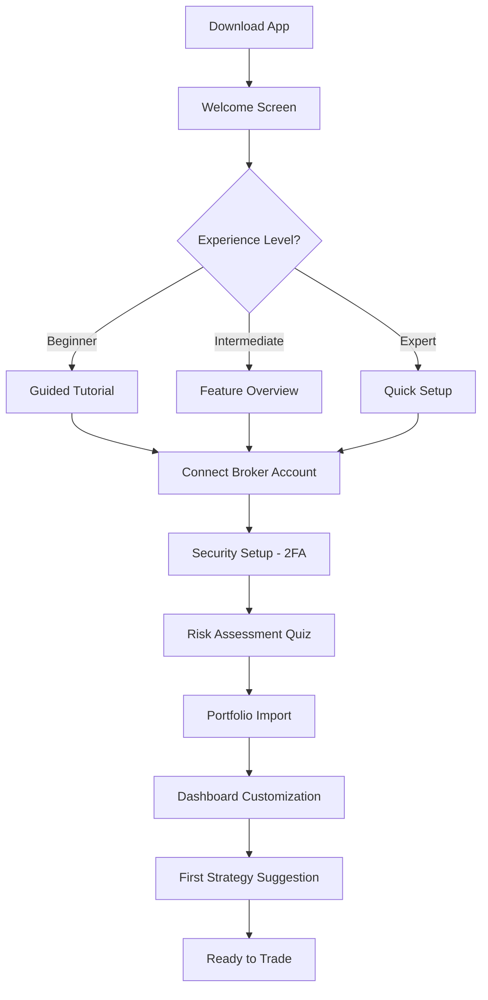
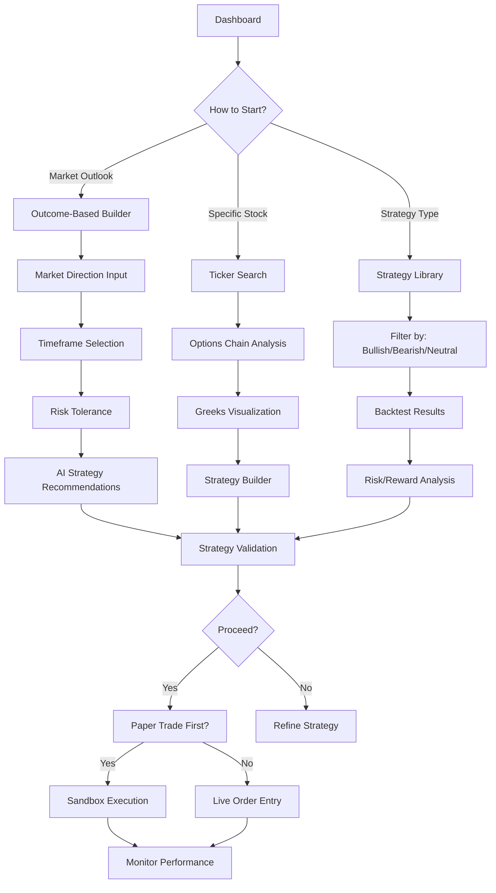
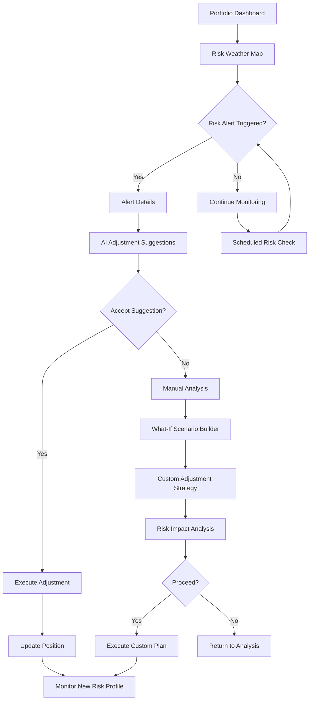
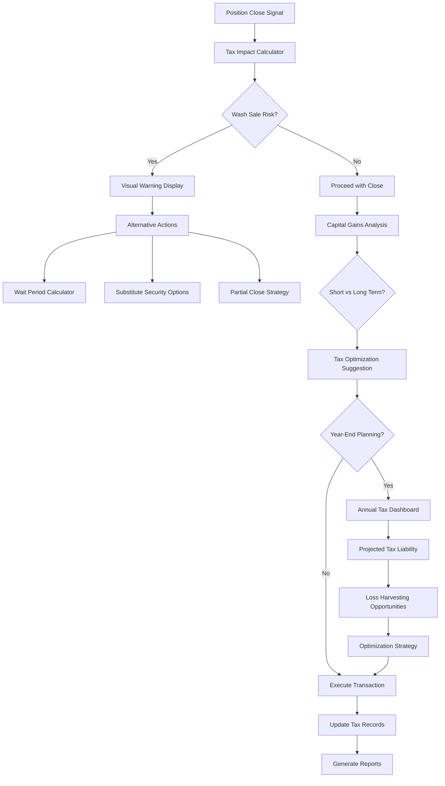
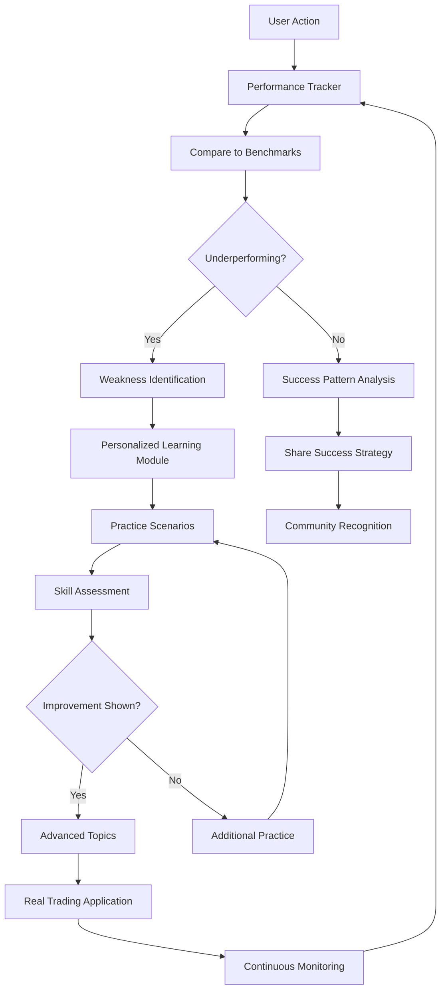
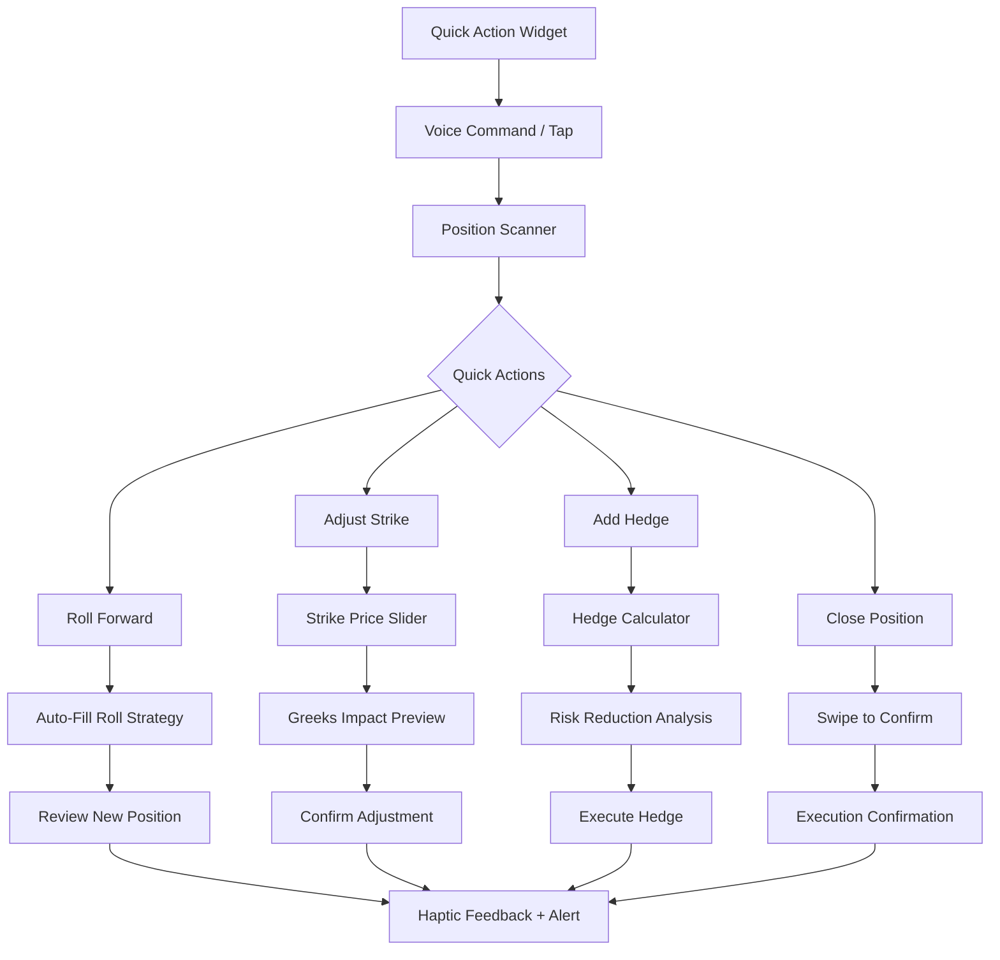
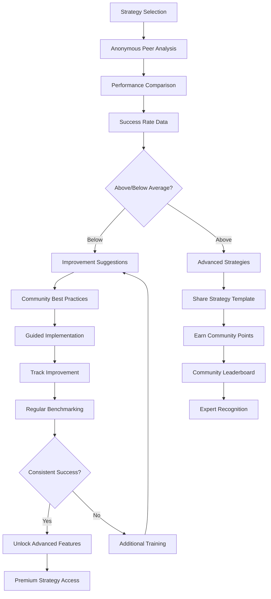

# Refract.trade - Key User Flow Diagrams

## 1. Onboarding & Setup Flow

## 2. Strategy Discovery & Creation Flow

## 3. Risk Monitoring & Position Management Flow

## 4. Tax Optimization Workflow

## 5. Learning & Improvement Flow

## 6. Mobile-Specific Quick Trade Flow

## 7. Social Intelligence & Benchmarking Flow

## User Flow Key Principles

### Mobile-First Design
- Maximum 3 taps to execute any common action
- Swipe gestures for quick navigation
- Voice commands for hands-free operation
- Biometric authentication for security

### Progressive Disclosure
- Show essential information first
- Drill-down capabilities for detailed analysis
- Contextual help and tooltips
- Adaptive complexity based on user experience

### Error Prevention
- Pre-trade risk checks
- Confirmation screens for high-impact actions
- Automatic save states
- Undo capabilities where appropriate

### Personalization
- Adaptive UI based on usage patterns
- Customizable dashboard layouts
- Intelligent notification timing
- Learning path recommendations

### Performance Optimization
- Predictive data loading
- Offline capability for critical functions
- Background sync for real-time updates
- Efficient state management